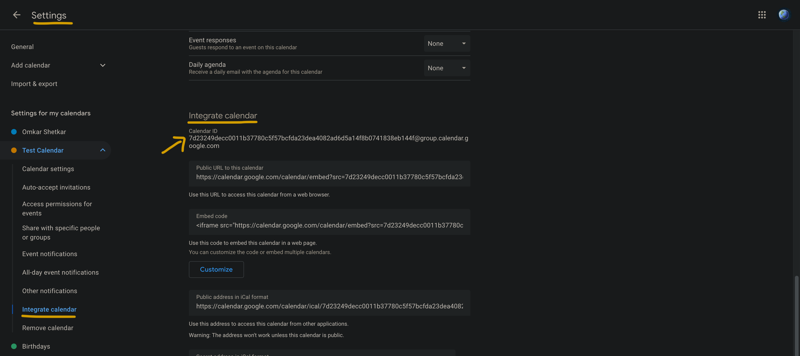
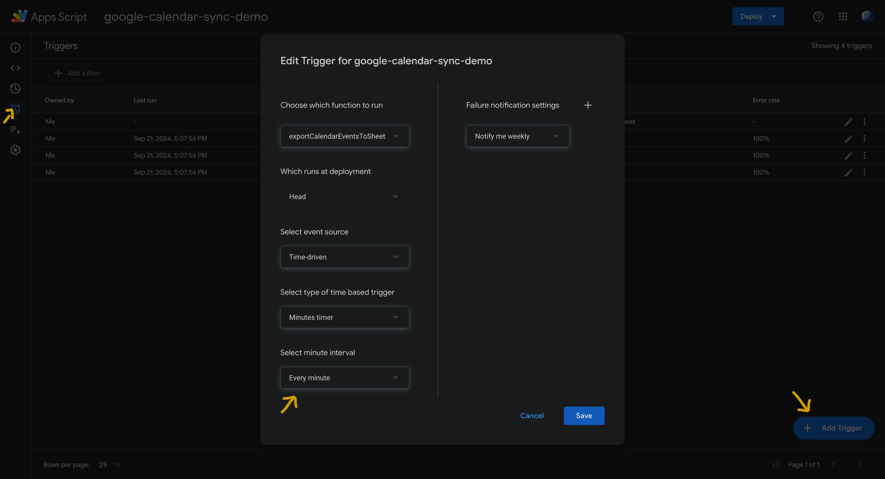

# Import Google Calendar Events into Google Sheet

- Every fixed interval of time we try to sync with Google Calendar and import events into Google Sheet.

## Demo

- For this, we need to create Google Apps Script in Google Sheet.

If you are new to Apps Script concept, please refer to my blog post: https://medium.com/@omkarshetkar/automation-using-telegram-bot-google-sheet-and-ai-2bbe57cf4992

- To make a connection with Google Calendar, we need to have Calendar ID.

- ` const calendar = CalendarApp.getCalendarById(calendarId);`
  will give calendar object to retrieve all events.

More in-depth details of Calendar API can be read here: https://developers.google.com/apps-script/reference/calendar

Then, we populate the sheet with retrieved event details.

- To run `exportCalendarEventsToSheet` at some frequency, we create a trigger.

